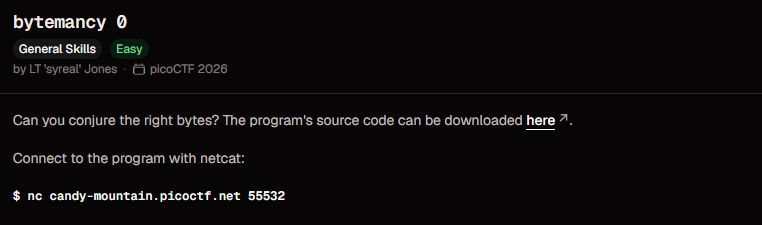
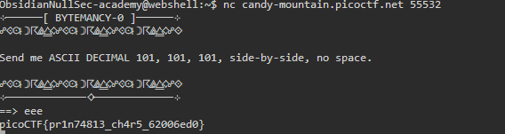

# Bytemancy 0

**Points:** N/A

**Platform:** PicoCTF

**Difficulty:** Easy

**Date Completed:** 2026-09-21

---

## Description

Can you conjure the right bytes? The program's source code can be downloaded here.

Connect to the program with netcat:

```bash
nc candy-mountain.picoctf.net 55532
```



---

## Category

General Skills

---

## Solution

### Initial Analysis

This is the warm-up entry in the Bytemancy series (see [Bytemancy 1](../Bytemancy%201/README.md) for the follow-up challenge). Connecting with netcat prints a banner and a single instruction:

```text
+--------[ BYTEMANCY-0 ]--------+

Send me ASCII DECIMAL 101, 101, 101, side-by-side, no space.

+--------------------------------+

==>
```

The instruction lists **three** decimal values, `101`, `101`, `101`, separated by commas. Each one is an ASCII code that has to be converted to its character, and the three resulting characters are then sent back concatenated with no spaces between them. Unlike [Bytemancy 1](../Bytemancy%201/README.md), where a single value was repeated many times, here it's simply the same value listed three times.

### Step-by-Step Walkthrough

#### Step 1: Convert each decimal value to ASCII

Decimal `101` is the lowercase letter **`e`** (this can be checked with `python3 -c "print(chr(101))"`, an ASCII table, or an online converter). Since all three listed values are `101`, all three characters are `e`.

#### Step 2: Concatenate them with no space

"Side-by-side, no space" means the three characters are joined into a single unbroken string:

```text
e + e + e = eee
```

#### Step 3: Send it to the service

I connected with netcat and typed `eee` at the `==>` prompt:

```bash
nc candy-mountain.picoctf.net 55532
```

### Finding the Flag

The service accepted `eee` and printed the flag directly below it:

```text
==> eee
picoCTF{pr1n74813_ch4r5_62006ed0}
```



---

## Flag

```
picoCTF{pr1n74813_ch4r5_62006ed0}
```

---

## Tools Used

- **netcat (`nc`)** - Connected to the challenge server
- **Python (`chr()`)** - Converted decimal 101 to its ASCII character

---

## Lessons Learned

- **ASCII codes map numbers to characters:** Decimal 101 is `e`. Common values worth memorizing: `A` is 65, `a` is 97, `0` is 48.
- **Read the list literally:** The prompt gave three separate values (even though they happened to be identical), not one value to repeat three times. Converting and concatenating each one individually is what "side-by-side, no space" was asking for.
- **A good warm-up before Bytemancy 1:** The same idea (decimal-to-ASCII, then join with no separator) scales up in [Bytemancy 1](../Bytemancy%201/README.md), where the value is repeated over a thousand times instead of listed three times, making manual typing impractical.

---

## References

- [picoCTF](https://picoctf.org/)
- [ASCII table (Wikipedia)](https://en.wikipedia.org/wiki/ASCII)
- [nc manual page](https://man7.org/linux/man-pages/man1/ncat.1.html)

---

## Screenshots

All screenshots for this write-up are stored in the shared `PicoCTF/images/` directory:

- `bytemancy-0-challenge.png` - Challenge description
- `bytemancy-0-session.png` - Full terminal session, from the banner and instruction to the submitted answer and flag

---

## Notes

- I didn't download the challenge's source code, since the on-screen instruction was enough to solve it.
- The decimal values in the instruction (`101, 101, 101`) came from my own instance. picoCTF may generate different values per instance, so convert and concatenate whatever your own prompt shows.
