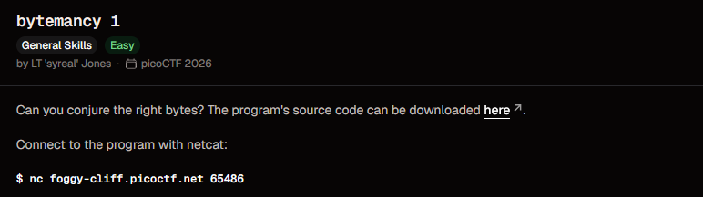
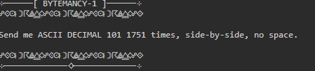
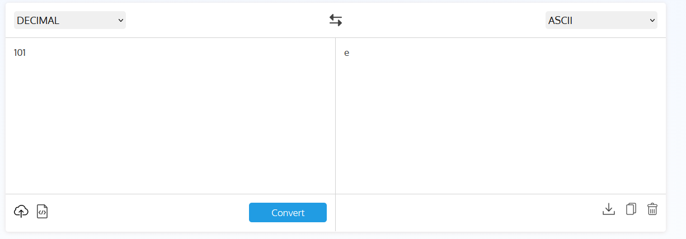
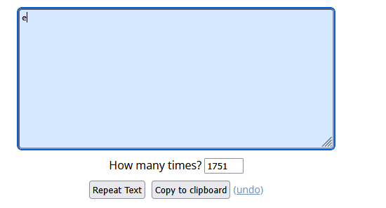
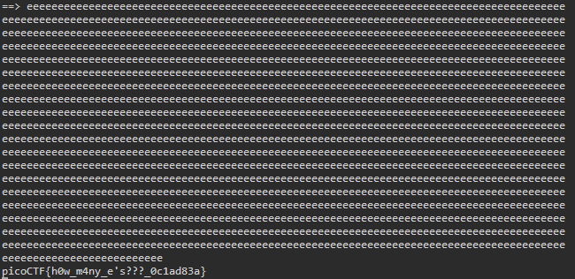

# Bytemancy 1

**Points:** N/A

**Platform:** PicoCTF

**Difficulty:** Easy

**Date Completed:** 2026-09-20

---

## Description

Can you conjure the right bytes? The program's source code can be downloaded here.

Connect to the program with netcat:

```bash
nc foggy-cliff.picoctf.net 65486
```



---

## Category

General Skills

---

## Solution

### Initial Analysis

The challenge is a netcat service. Connecting to it prints a banner and a single instruction:

```text
Send me ASCII DECIMAL 101 1751 times, side-by-side, no space.
```



There is nothing to exploit. The task is to work out which character the decimal value `101` stands for, then send that character 1751 times in a row on a single line. Typing it by hand is impractical, so a text-repeating tool does the work.

### Step-by-Step Walkthrough

#### Step 1: Convert the decimal value to ASCII

The service asks for "ASCII DECIMAL 101", meaning the character whose ASCII code is 101. I used an online decimal-to-ASCII converter to check:



Decimal `101` is the lowercase letter **`e`**.

#### Step 2: Repeat the character 1751 times

I typed a single `e` into an online text repeater and set "How many times?" to `1751`. The repeater leaves no separator between copies by default, which matches the "side-by-side, no space" requirement.



I then used "Copy to clipboard" to copy the result.

#### Step 3: Send it to the service

I connected with netcat, pasted the 1751 `e` characters at the `==>` prompt and pressed Enter.

```bash
nc foggy-cliff.picoctf.net 65486
```

### Finding the Flag

The service accepted the input and printed the flag straight after the pasted line:



---

## Flag

```
picoCTF{h0w_m4ny_e's???_0c1ad83a}
```

---

## Tools Used

- **netcat (`nc`)** - Connected to the challenge server
- **Online decimal-to-ASCII converter** - Confirmed that decimal 101 is `e`
- **Online text repeater** - Generated the 1751 repeated `e` characters to paste

---

## Lessons Learned

- **ASCII codes map numbers to characters:** Decimal 101 is `e`. Knowing common values (`A` is 65, `a` is 97, `0` is 48) saves a lookup.
- **Read the instruction literally:** "Side-by-side, no space" means one unbroken string with no spaces or newlines between the characters.
- **Repetitive input can be generated:** Repeating something 1751 times by hand is error-prone. A repeater tool, or a one-line script, produces it exactly.

---

## References

- [picoCTF](https://picoctf.org/)
- [ASCII table (Wikipedia)](https://en.wikipedia.org/wiki/ASCII)
- [nc manual page](https://man7.org/linux/man-pages/man1/ncat.1.html)

---

## Screenshots

All screenshots for this write-up are stored in the shared `PicoCTF/images/` directory:

- `bytemancy-1-challenge.png` - Challenge description
- `bytemancy-1-prompt.png` - Instruction shown after connecting
- `bytemancy-1-ascii-converter.png` - Decimal 101 converted to ASCII
- `bytemancy-1-repeat-text.png` - Repeating `e` 1751 times
- `bytemancy-1-flag.png` - Server response containing the flag

---

## Notes

- I didn't download the challenge's source code, since the on-screen instruction was enough to solve it.
- The same input can be generated in the terminal without a website, for example with `python3 -c "print('e' * 1751)"`. I used the online repeater for this solve, so the one-liner is untested.
- The number of repetitions (`1751`) came from the prompt on my instance. It may differ between instances, so read it from your own prompt.
