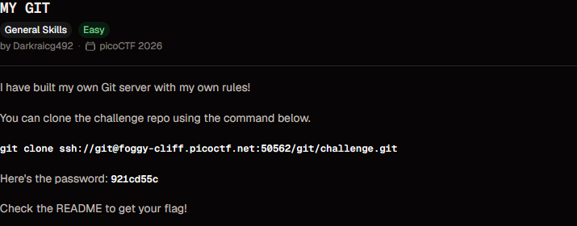
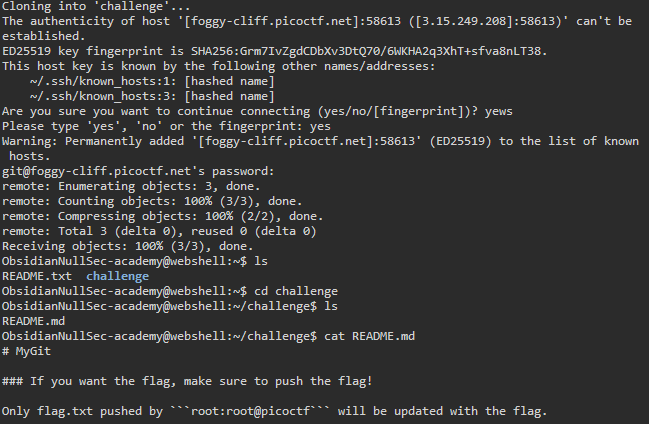
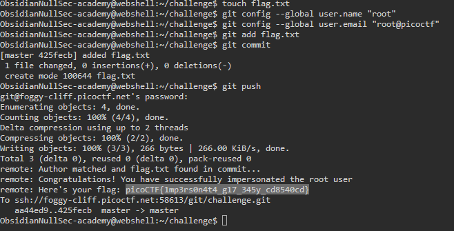

# MY GIT

**Points:** N/A

**Platform:** PicoCTF

**Difficulty:** Easy

**Date Completed:** 2026-09-20

---

## Description

I have built my own Git server with my own rules!

You can clone the challenge repo using the command below.

```bash
git clone ssh://git@foggy-cliff.picoctf.net:50562/git/challenge.git
```

Here's the password: `921cd55c`

Check the README to get your flag!



---

## Category

General Skills

---

## Solution

### Initial Analysis

The challenge gives us a custom Git server and the credentials to clone a repository from it. The description says the flag is in the repository's README, so the first move is to clone the repo and read it.

### Step-by-Step Walkthrough

#### Step 1: Clone the repository

I ran the clone command from the challenge description in the picoCTF webshell. The first connection asks whether to trust the server's host key, so I answered `yes`, then entered the password given in the description.

```bash
git clone ssh://git@foggy-cliff.picoctf.net:50562/git/challenge.git
```

The clone succeeded and created a `challenge` directory.

#### Step 2: Read the README

```bash
cd challenge
ls
cat README.md
```

```text
# MyGit

### If you want the flag, make sure to push the flag!

Only flag.txt pushed by ```root:root@picoctf``` will be updated with the flag.
```



The README doesn't contain the flag. It describes the server's rule instead: we have to **push a file named `flag.txt`**, and the push only counts if the commit's author is `root` with the email `root@picoctf`.

Git doesn't verify who an author is. The name and email on a commit are just text taken from the local Git config, so we can set them to whatever we like. That means we can impersonate the `root` user.

#### Step 3: Set the Git identity to root

```bash
git config --global user.name "root"
git config --global user.email "root@picoctf"
```

#### Step 4: Create, commit and push flag.txt

The file can be empty. The server only checks that a file called `flag.txt` is in the commit and that the author matches.

```bash
touch flag.txt
git add flag.txt
git commit
git push
```

The commit message was `added flag.txt`. `git push` prompts for the same password as the clone.

### Finding the Flag

The server inspects the pushed commit and prints its response back to us through the `remote:` lines of the push output. It matches the author and the presence of `flag.txt`, then prints the flag:

```text
remote: Author matched and flag.txt found in commit...
remote: Congratulations! You have successfully impersonated the root user
remote: Here's your flag: picoCTF{1mp3rs0n4t4_g17_345y_cd8540cd}
```



---

## Flag

```
picoCTF{1mp3rs0n4t4_g17_345y_cd8540cd}
```

---

## Tools Used

- **git** - Cloned the repository, set the author identity, committed and pushed `flag.txt`
- **ssh** - Transport used by Git to connect to the challenge server
- **picoCTF webshell** - Terminal used to run all the commands

---

## Lessons Learned

- **Git authorship is not authentication:** `user.name` and `user.email` are self-reported. Anyone can create a commit that claims to be from any author, so a server that trusts them as proof of identity is trivially bypassed.
- **Real identity checks need signatures:** To actually verify who wrote a commit, use signed commits (GPG or SSH signing) and have the server verify the signature, or restrict pushes by authenticated account rather than commit metadata.
- **Read the README rules:** The challenge said "check the README", but the README held the rule for getting the flag rather than the flag itself.

---

## References

- [picoCTF](https://picoctf.org/)
- [git-config documentation](https://git-scm.com/docs/git-config)
- [Git Tools - Signing Your Work](https://git-scm.com/book/en/v2/Git-Tools-Signing-Your-Work)

---

## Screenshots

All screenshots for this write-up are stored in the shared `PicoCTF/images/` directory:

- `my-git-challenge.png` - Challenge description
- `my-git-clone-readme.png` - Cloning the repo and reading the README
- `my-git-push-flag.png` - Setting the identity, committing and pushing `flag.txt`, and the flag returned by the server

---

## Notes

- The challenge description lists port `50562`, but my screenshots show port `58613`. picoCTF launches a new instance each time, so the port differs between instances. Use the one from your own instance.
- I used `--global` for the Git config because the webshell is a throwaway environment. In a normal setup, omit `--global` so the fake identity only applies to this one repo.
- `flag.txt` was empty (created with `touch`). Its contents don't matter to the server's check.
