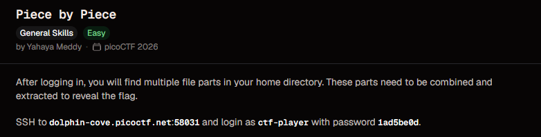
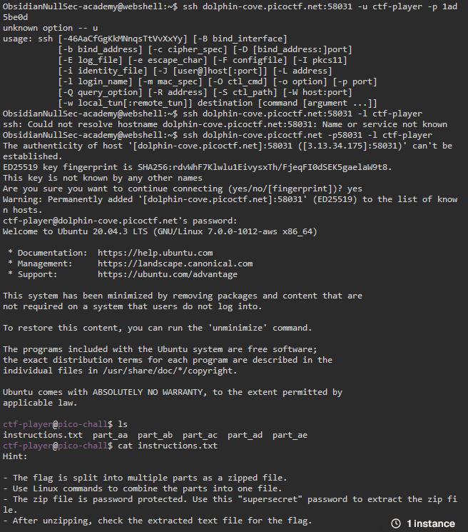
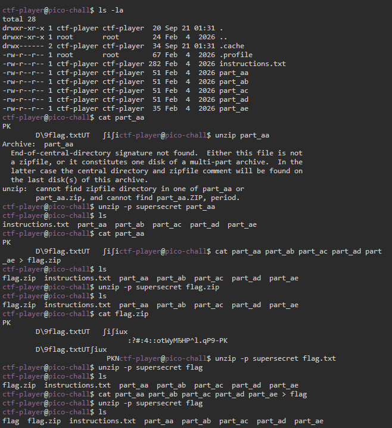
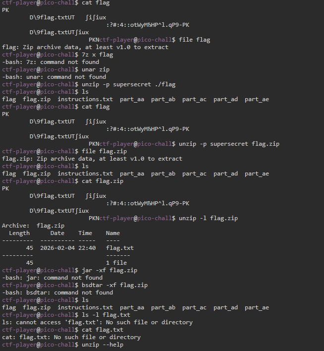
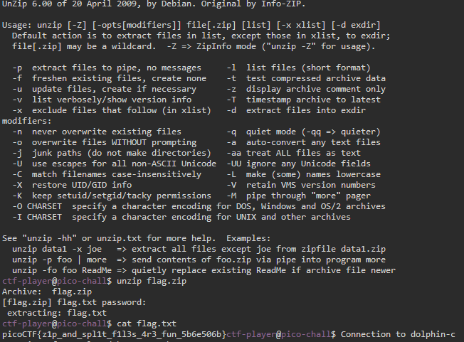

# Piece by Piece

**Points:** N/A

**Platform:** PicoCTF

**Difficulty:** Easy

**Date Completed:** 2026-09-21

---

## Description

After logging in, you will find multiple file parts in your home directory. These parts need to be combined and extracted to reveal the flag.

SSH to `dolphin-cove.picoctf.net:58031` and login as `ctf-player` with password `1ad5be0d`.



---

## Category

General Skills

---

## Solution

### Initial Analysis

The challenge description says a file has been split into pieces that live in the home directory after logging in over SSH, and that the pieces need to be **combined** first and then **extracted**. That phrasing, plus file names like `part_aa`, `part_ab`, ... strongly suggests the classic Linux `split` utility, which breaks a large file into fixed-size chunks and names them with a two-letter suffix (`aa`, `ab`, `ac`, ...). Reversing a `split` is just concatenating the parts back together in order with `cat`.

### Step-by-Step Walkthrough

#### Step 1: Connect over SSH

My first couple of attempts used the wrong syntax: `ssh host:port -u user -p pass` isn't valid OpenSSH syntax, and putting the port inside the hostname isn't either:

```text
$ ssh dolphin-cove.picoctf.net:58031 -u ctf-player -p 1ad5be0d
unknown option -- u
$ ssh dolphin-cove.picoctf.net:58031 -l ctf-player
ssh: Could not resolve hostname dolphin-cove.picoctf.net:58031: Name or service not known
```

The port has to be given with `-p` (a *number*, not appended to the hostname), and the login name with `-l`:

```bash
ssh dolphin-cove.picoctf.net -p 58031 -l ctf-player
```

This time it worked. I accepted the new host key (`yes`) and entered the password `1ad5be0d` from the challenge description.



#### Step 2: Read the instructions

```bash
ls
cat instructions.txt
```

```text
instructions.txt part_aa part_ab part_ac part_ad part_ae

Hint:

- The flag is split into multiple parts as a zipped file.
- Use Linux commands to combine the parts into one file.
- The zip file is password protected. Use this "supersecret" password to extract the zip file.
- After unzipping, check the extracted text file for the flag.
```

This confirms the plan: combine `part_aa` .. `part_ae` into a zip file, then extract it with the password `supersecret`.

#### Step 3: Inspect the parts

```bash
ls -la
```

```text
-rw-r--r-- 1 ctf-player ctf-player  282 Feb  4 2026 instructions.txt
-rw-r--r-- 1 ctf-player ctf-player   51 Feb  4 2026 part_aa
-rw-r--r-- 1 ctf-player ctf-player   51 Feb  4 2026 part_ab
-rw-r--r-- 1 ctf-player ctf-player   51 Feb  4 2026 part_ac
-rw-r--r-- 1 ctf-player ctf-player   51 Feb  4 2026 part_ad
-rw-r--r-- 1 ctf-player ctf-player   35 Feb  4 2026 part_ae
```

Four parts are exactly 51 bytes and the last one (`part_ae`) is smaller, at 35 bytes: exactly the pattern `split` produces when it cuts a file into fixed-size blocks with a shorter final block. `cat part_aa` confirms it: the file starts with `PK`, the magic bytes of a ZIP archive, followed by unreadable binary and the string `flag.txt` from the archive's internal file name, so `part_aa` is just the first slice of a ZIP file's raw bytes, not a complete file on its own.

Trying to unzip a single slice fails as expected:

```text
$ unzip part_aa
Archive:  part_aa
  End-of-central-directory signature not found.  Either this file is not
  a zipfile, or it constitutes one disk of a multi-part archive. ...
unzip:  cannot find zipfile directory in one of part_aa or
        part_aa.zip, and cannot find part_aa.ZIP, period.
```

`unzip` correctly recognizes that this looks like one disk of a multi-part archive, but can't find the rest because the pieces haven't been joined yet.



#### Step 4: Combine the parts

`cat` joins files in the order they're listed, and shell globbing/alphabetical order here already matches the correct sequence (`part_aa`, `part_ab`, `part_ac`, `part_ad`, `part_ae`):

```bash
cat part_aa part_ab part_ac part_ad part_ae > flag.zip
```

`file flag.zip` and `unzip -l flag.zip` both confirm the reassembly worked:

```text
$ file flag.zip
flag.zip: Zip archive data, at least v1.0 to extract
$ unzip -l flag.zip
Archive:  flag.zip
  Length      Date    Time    Name
---------  ---------- -----   ----
       45  2026-02-04 22:40   flag.txt
---------                     -------
       45                     1 file
```

The archive is now valid and contains a single 45-byte file, `flag.txt`.

#### Step 5: A few wrong turns while extracting

I tried supplying the password directly as an argument with `unzip -p supersecret flag.zip`, but that didn't extract anything: `-p` (lowercase) means "extract to pipe / stdout", not "here's the password". I also tried a few alternative archive tools, none of which were installed on this minimal box:

```text
$ 7z x flag.zip
-bash: 7z: command not found
$ unar flag.zip
-bash: unar: command not found
$ jar -xf flag.zip
-bash: jar: command not found
$ bsdtar -xf flag.zip
-bash: bsdtar: command not found
```



Checking `unzip --help` confirmed `-p` really is the pipe option, with no plain command-line password flag shown in the summary. Rather than hunt further, I just ran `unzip` with no password flag at all and let it prompt interactively.

### Finding the Flag

```bash
unzip flag.zip
```

```text
Archive:  flag.zip
[flag.zip] flag.txt password:
  extracting: flag.txt
```

I typed `supersecret` at the password prompt, and the archive extracted `flag.txt`:

```bash
cat flag.txt
```

```text
picoCTF{z1p_and_spl1t_f1l3s_4r3_fun_5b6e506b}
```



---

## Flag

```
picoCTF{z1p_and_spl1t_f1l3s_4r3_fun_5b6e506b}
```

---

## Tools Used

- **ssh** - Connected to the challenge server
- **cat** - Inspected the raw parts and concatenated them back into a single ZIP file
- **file** - Confirmed the reassembled file was a valid ZIP archive
- **unzip** - Listed the archive contents and extracted `flag.txt` with the given password
- **picoCTF webshell** - Terminal used to run all the commands

---

## Lessons Learned

- **`split`-style naming is a strong hint:** File names ending in a two-letter alphabetic suffix (`_aa`, `_ab`, `_ac`, ...) are the signature of the `split` command. The fix is always the same: `cat` them back together in alphabetical order.
- **Concatenation order matters:** Since `split` numbers its output alphabetically in the exact order it cut the original file, `cat part_a* > output` (or simply listing them in order) reassembles it correctly. Getting the order wrong produces a corrupted archive.
- **`unzip -p` is not a password flag:** Lowercase `-p` means "extract to stdout / pipe", which is easy to confuse with "provide the password". The command-line password flag is uppercase `-P` (`unzip -P password file.zip`); letting `unzip` prompt interactively works just as well and avoids the mix-up entirely.
- **A minimized system won't have every tool:** `7z`, `unar`, `jar`, and `bsdtar` were all missing on this box. `unzip` and `file`, both very commonly preinstalled, were enough to solve it.
- **Trust `file`, not the extension:** Renaming the reassembled data to `flag.zip` didn't make it a ZIP; running `file` against it verified the actual format before trusting `unzip` to work on it.

---

## References

- [picoCTF](https://picoctf.org/)
- [split manual page](https://man7.org/linux/man-pages/man1/split.1.html)
- [unzip manual page](https://linux.die.net/man/1/unzip)
- [file manual page](https://man7.org/linux/man-pages/man1/file.1.html)

---

## Screenshots

All screenshots for this write-up are stored in the shared `PicoCTF/images/` directory:

- `piece-by-piece-challenge.png` - Challenge description
- `piece-by-piece-ssh-login.png` - SSH connection attempts, successful login, and `instructions.txt`
- `piece-by-piece-combine-parts.png` - Listing the parts, inspecting `part_aa`, and the failed single-part unzip
- `piece-by-piece-troubleshooting.png` - The wrong `-p` flag attempt and missing alternative archive tools
- `piece-by-piece-flag.png` - `unzip --help` output, the interactive password prompt, and the recovered flag

---

## Notes

- The challenge description lists port `58031`, which matched my session exactly, so there's no per-instance mismatch to call out here, unlike some other picoCTF challenges.
- `unzip -P supersecret flag.zip` (uppercase `-P`) would have worked non-interactively and skipped the prompt; I only discovered the plain interactive prompt worked and didn't go back to test the uppercase flag.
- The `flag.zip` file could equally have been named anything; the `.zip` extension is only there for readability, since `file` (not the extension) is what actually determines whether `unzip` can read it.
