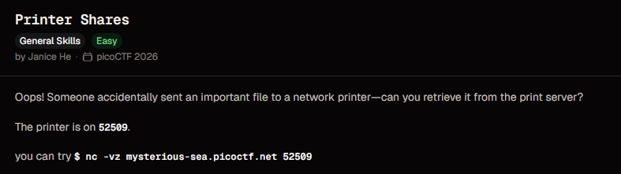
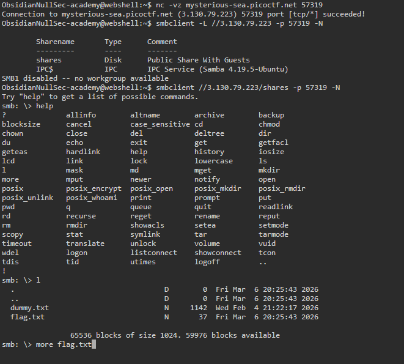
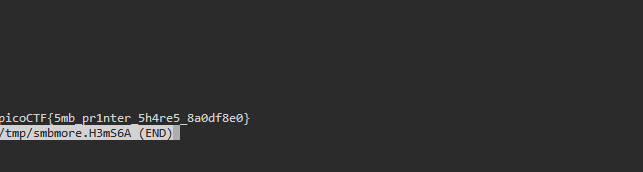

# Printer Shares

**Points:** N/A

**Platform:** PicoCTF

**Difficulty:** Easy

**Date Completed:** 2026-09-20

---

## Description

Oops! Someone accidentally sent an important file to a network printer - can you retrieve it from the print server?

The printer is on `52509`.

you can try `$ nc -vz mysterious-sea.picoctf.net 52509`



---

## Category

General Skills

---

## Solution

### Initial Analysis

The challenge mentions a "print server" and a file that was sent to a network printer. Print servers are commonly built on **SMB** (Server Message Block), the protocol behind Windows file and printer sharing, and on Linux it is usually served by **Samba**. The hint uses `nc -vz` to check that the port is open, which is the first thing to confirm before trying anything else.

The plan is:

1. Confirm the port is reachable.
2. List the shares the server exposes.
3. Connect to the share that holds the file and read it.

### Step-by-Step Walkthrough

#### Step 1: Check that the port is open

I ran the command from the challenge description in the picoCTF webshell. `-v` makes netcat verbose and `-z` makes it scan for a listener without sending any data.

```bash
nc -vz mysterious-sea.picoctf.net 57319
```

```text
Connection to mysterious-sea.picoctf.net (3.130.79.223) 57319 port [tcp/*] succeeded!
```

The port is open. The connection also shows the IP address behind the hostname, `3.130.79.223`, which is useful for the next step.

#### Step 2: List the available SMB shares

`smbclient -L` lists the shares on a server. Since SMB normally runs on port 445, the non-standard port has to be given with `-p`. The `-N` flag skips the password prompt and attempts an anonymous (null) login.

```bash
smbclient -L //3.130.79.223 -p 57319 -N
```

```text
        Sharename       Type      Comment
        ---------       ----      -------
        shares          Disk      Public Share With Guests
        IPC$            IPC       IPC Service (Samba 4.19.5-Ubuntu)
SMB1 disabled -- no workgroup available
```

The anonymous login worked and the server exposes two shares:

- **`shares`** - A disk share described as "Public Share With Guests", so no credentials are needed.
- **`IPC$`** - The default inter-process communication share used by SMB itself. It doesn't hold files.

The server is running Samba 4.19.5 on Ubuntu. `shares` is the one to look at.

#### Step 3: Connect to the share

I connected to the `shares` share, again anonymously and on the custom port. This drops us into an interactive `smb: \>` prompt, similar to an FTP client.

```bash
smbclient //3.130.79.223/shares -p 57319 -N
```

Typing `help` lists the available commands. The ones needed here are `l` (or `ls`) to list files, `get` to download them and `more` to page through a file on the server without downloading it.

#### Step 4: List the files

```text
smb: \> l
  .                                   D        0  Fri Mar  6 20:25:43 2026
  ..                                  D        0  Fri Mar  6 20:25:43 2026
  dummy.txt                           N     1142  Wed Feb  4 21:22:17 2026
  flag.txt                            N       37  Fri Mar  6 20:25:43 2026
```

There are two files. `dummy.txt` is 1142 bytes and looks like filler, while `flag.txt` is only 37 bytes, small enough to be one line. That matches the length of a picoCTF flag plus a trailing newline.



#### Step 5: Read flag.txt

Instead of downloading the file with `get`, I used `more` to view it directly from the SMB prompt:

```text
smb: \> more flag.txt
```

`more` downloads the file to a temporary location (`/tmp/smbmore.H3mS6A` here) and opens it in the pager, so the flag appears on screen.

### Finding the Flag

The pager displays the contents of `flag.txt`:

```text
picoCTF{5mb_pr1nter_5h4re5_8a0df8e0}
/tmp/smbmore.H3mS6A (END)
```



---

## Flag

```
picoCTF{5mb_pr1nter_5h4re5_8a0df8e0}
```

---

## Tools Used

- **netcat (`nc`)** - Verified that the challenge port was open
- **smbclient** - Listed the SMB shares and browsed the share with an anonymous login
- **picoCTF webshell** - Terminal used to run all the commands

---

## Lessons Learned

- **SMB shares can allow anonymous access:** The `shares` share was open to guests, so no username or password was needed. Null sessions like this are one of the first things to test when you find SMB, and one of the most common misconfigurations in real networks.
- **Enumerate before you connect:** `smbclient -L` shows what a server exposes so you know which share to open, rather than guessing share names.
- **Non-standard ports need `-p`:** SMB defaults to port 445, but the challenge runs it on a random high port. `smbclient` needs `-p <port>` or it will try the default and fail.
- **File sizes are a clue:** At 37 bytes, `flag.txt` was clearly the small file worth reading compared with the 1142-byte `dummy.txt`.
- **Don't expose file shares publicly:** SMB should be firewalled to trusted networks, guest access should be disabled, and sensitive documents should never sit on a shared printer or spool folder.

---

## References

- [picoCTF](https://picoctf.org/)
- [smbclient manual page](https://www.samba.org/samba/docs/current/man-html/smbclient.1.html)
- [Samba](https://www.samba.org/)
- [Server Message Block (Wikipedia)](https://en.wikipedia.org/wiki/Server_Message_Block)
- [HackTricks - Pentesting SMB](https://book.hacktricks.wiki/en/network-services-pentesting/pentesting-smb/index.html)

---

## Screenshots

All screenshots for this write-up are stored in the shared `PicoCTF/images/` directory:

- `printer-shares-challenge.png` - Challenge description
- `printer-shares-smbclient-session.png` - Port check, share listing, connecting to the share and listing its files
- `printer-shares-flag.png` - Contents of `flag.txt` shown in the pager

---

## Notes

- The challenge description lists port `52509`, but my screenshots show port `57319`. picoCTF launches a new instance each time, so the port differs between instances. Use the one from your own instance.
- `get flag.txt` would work equally well. It saves the file to the local working directory and you can then read it with `cat`. I used `more` to skip the extra step.
- The `-N` flag means "no password". Without it, `smbclient` prompts for a password, and pressing Enter at the prompt gives the same anonymous login.
- The `smbmore` temporary file name (`H3mS6A`) is randomly generated by `smbclient` and will differ on every run.
