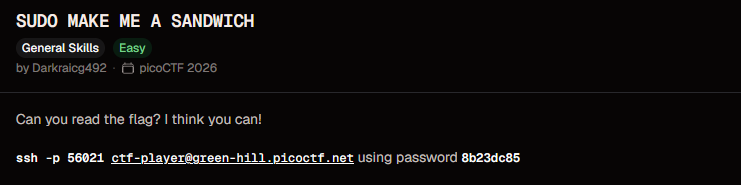
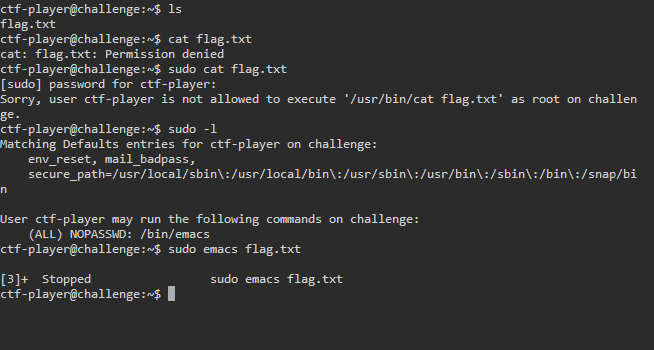
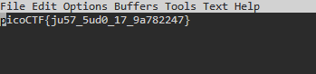

# Sudo Make Me a Sandwich

**Points:** N/A

**Platform:** PicoCTF

**Difficulty:** Easy

**Date Completed:** 2026-09-21

---

## Description

Can you read the flag? I think you can!

`ssh -p 56021 ctf-player@green-hill.picoctf.net` using password `8b23dc85`



---

## Category

General Skills

---

## Solution

### Initial Analysis

The challenge title is a nod to the classic [xkcd "sudo make me a sandwich"](https://xkcd.com/149/) joke: `sudo` lets a user run specific commands as root, and if one of those allowed commands can itself read files, run a shell, or edit arbitrary files, that's effectively the same as being root. So the plan is to log in, find that `flag.txt` isn't directly readable, then check `sudo -l` to see exactly what the account is allowed to run as root and use that program to get at the file instead.

### Step-by-Step Walkthrough

#### Step 1: Connect over SSH and try the obvious approach

```bash
ssh -p 56021 ctf-player@green-hill.picoctf.net
```

After logging in with the password from the description, I looked for the flag and tried to read it directly:

```text
ctf-player@challenge:~$ ls
flag.txt
ctf-player@challenge:~$ cat flag.txt
cat: flag.txt: Permission denied
```

`flag.txt` exists in the home directory but the `ctf-player` account doesn't have permission to read it, so it must be owned by another user (root, given the challenge's theme).

#### Step 2: Try sudo directly

```text
ctf-player@challenge:~$ sudo cat flag.txt
[sudo] password for ctf-player:
Sorry, user ctf-player is not allowed to execute '/usr/bin/cat flag.txt' as root on challenge.
```

`sudo` rejects this outright. `cat` itself isn't on the list of commands this account is allowed to run as root, so guessing at commands isn't the way in. The right move is to ask `sudo` what it *will* allow.

#### Step 3: Check what sudo actually allows

```bash
sudo -l
```

```text
Matching Defaults entries for ctf-player on challenge:
    env_reset, mail_badpass,
    secure_path=/usr/local/sbin\:/usr/local/bin\:/usr/sbin\:/usr/bin\:/sbin\:/bin\:/snap/bin

User ctf-player may run the following commands on challenge:
    (ALL) NOPASSWD: /bin/emacs
```

This is the misconfiguration the challenge is built around: `ctf-player` can run `/bin/emacs` as root, with no password required. Text editors like Emacs (and Vim, less, more, and many others) are documented on [GTFOBins](https://gtfobins.github.io/gtfobins/emacs/) as privilege-escalation vectors when allowed through `sudo`, because they can open, edit, or shell out to read any file the invoking user (root, in this case) has access to, regardless of what the original account could read on its own.



#### Step 4: Run the allowed command as root

```bash
sudo emacs flag.txt
```

Since Emacs runs with root's permissions once launched through `sudo`, it can open `flag.txt` even though the shell couldn't. The session's terminal showed the job get suspended right after launching it:

```text
ctf-player@challenge:~$ sudo emacs flag.txt

[3]+  Stopped                 sudo emacs flag.txt
```

That's because this environment has a display available for Emacs to use, so instead of staying inside the terminal, it opened its normal graphical window (with the usual `File Edit Options Buffers Tools Text Help` menu bar) and handed control of the shell back, leaving the `sudo emacs` job stopped in the background from the terminal's point of view.

### Finding the Flag

With `flag.txt` open as root, Emacs simply displays its contents in the buffer, permission checks and all, since it's root doing the reading:

```text
picoCTF{ju57_5ud0_17_9a782247}
```



---

## Flag

```
picoCTF{ju57_5ud0_17_9a782247}
```

---

## Tools Used

- **ssh** - Connected to the challenge server
- **sudo -l** - Enumerated which commands the account could run as root
- **emacs** - The `sudo`-allowed program used to read the root-owned flag
- **picoCTF webshell** - Terminal used to run all the commands

---

## Lessons Learned

- **`sudo -l` is the first move, not `sudo` guessing:** Rather than trying random commands with `sudo`, listing what's actually permitted shows exactly which program to target.
- **A `sudo` rule is only as safe as the program it allows:** Letting an account run a full-featured editor like Emacs (or Vim, less, awk, find, and many others) as root is functionally the same as giving it root, because those programs can read, write, or execute arbitrary files, or spawn a shell, once they're running with root's permissions.
- **GTFOBins is worth knowing:** [GTFOBins](https://gtfobins.github.io/) catalogs exactly this kind of escape for dozens of common Unix binaries. If a `sudo -l` listing shows something on that list, it's almost certainly the intended path.
- **Even without a GUI, this still works:** The graphical Emacs window made the flag visible directly in this case, but the same privilege escalation works from a plain terminal too. From inside `sudo emacs`, `M-x shell` or `M-x term` spawns a shell that inherits root's permissions, and `C-x C-f` (find-file) can open any file on the system regardless of the invoking user's own permissions.
- **The proper fix:** Never grant `sudo` access to an editor, pager, or interpreter without heavily restricting what it can be pointed at (or avoid it entirely), and audit `sudoers` entries for exactly this class of mistake.

---

## References

- [picoCTF](https://picoctf.org/)
- [GTFOBins - emacs](https://gtfobins.github.io/gtfobins/emacs/)
- [sudoers manual page](https://man7.org/linux/man-pages/man5/sudoers.5.html)
- [xkcd 149 - Sandwich](https://xkcd.com/149/)

---

## Screenshots

All screenshots for this write-up are stored in the shared `PicoCTF/images/` directory:

- `sudo-sandwich-challenge.png` - Challenge description
- `sudo-sandwich-terminal-session.png` - Failed `cat` and `sudo cat` attempts, followed by `sudo -l` revealing the `emacs` rule
- `sudo-sandwich-flag.png` - Emacs window with `flag.txt` open as root, showing the flag

---

## Notes

- The challenge description lists port `56021`, which matched my session, so no per-instance port mismatch to flag here.
- I didn't need to enter an interactive root shell to solve this: simply opening the protected file in the `sudo`-allowed editor was enough, since the editor's own read access came from running as root.
- The `[sudo] password for ctf-player:` prompt in Step 2 is a bit misleading, since the account's own login password works there, but it doesn't matter for `cat`, since that command was never in the allowed list regardless of authentication.
