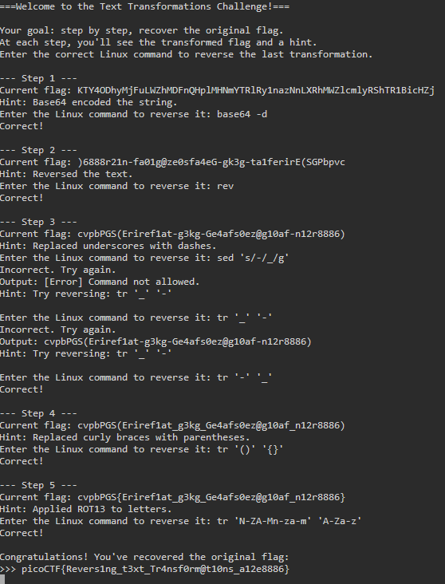

# Undo

**Points:** N/A

**Platform:** PicoCTF

**Difficulty:** Easy

**Date Completed:** 2026-09-19

---

## Description

Can you reverse a series of Linux text transformations to recover the original flag?

Start searching for the flag here nc foggy-cliff.picoctf.net 61917

---

## Category

General Skills

---

## Solution

### Initial Analysis

The challenge is a netcat service that applies a series of text transformations to the flag and then quizzes us on how to undo them. At each step it shows the current (transformed) flag and a hint describing the last transformation applied. We have to answer with the Linux command that reverses it.

Because the transformations were applied in sequence, they have to be undone in the **reverse order**, starting with the most recent one. The hint at each step tells us exactly which transformation to reverse, so the whole challenge comes down to knowing which command undoes which transformation.

The full session is shown below, and each step is broken down in the walkthrough.



### Step-by-Step Walkthrough

#### Step 1: Access the challenge via netcat

The command to access the challenge is provided in the prompt so we simply enter that into our linux terminal and we see the following prompt:

```text
===Welcome to the Text Transformations Challenge!===

Your goal: step by step, recover the original flag.
At each step, you'll see the transformed flag and a hint.
Enter the correct Linux command to reverse the last transformation.

--- Step 1 ---
Current flag: KTY4ODhyMjFuLWZhMDFnQHplMHNmYTRlRy1nazNnLXRhMWZlcmlyRShTR1BicHZj
Hint: Base64 encoded the string.
```

The hint says the string was Base64 encoded, so we decode it with `base64 -d`.

```bash
base64 -d
```

The service replies `Correct!` and moves on to the next step.

#### Step 2: Reverse the text

```text
--- Step 2 ---
Current flag: )6888r21n-fa01g@ze0sfa4eG-gk3g-ta1ferirE(SGPbpvc
Hint: Reversed the text.
```

The decoded string looks backwards (it starts with `)` and ends with `cvpbPGS`), which matches the hint. The `rev` command reverses each line of text.

```bash
rev
```

#### Step 3: Replace dashes with underscores

```text
--- Step 3 ---
Current flag: cvpbPGS(Eriref1at-g3kg-Ge4afs0ez@g10af-n12r8886)
Hint: Replaced underscores with dashes.
```

The underscores in the flag were replaced with dashes, so we need to turn the dashes back into underscores. My first attempt used `sed 's/-/_/g'`, but the service rejected it:

```text
Enter the correct Linux command to reverse it: sed 's/-/_/g'
Incorrect. Try again.
Output: [Error] Command not allowed.
Hint: Try reversing: tr '_' '-'
```

`sed` is not on the list of allowed commands, so only `tr` works here. I then made a second mistake and typed the hint verbatim, `tr '_' '-'`. That is the *forward* transformation (underscores to dashes), so it left the string unchanged:

```text
Enter the correct Linux command to reverse it: tr '_' '-'
Incorrect. Try again.
Output: cvpbPGS(Eriref1at-g3kg-Ge4afs0ez@g10af-n12r8886)
```

The hint shows the transformation that was applied, not its inverse. Swapping the arguments gives the correct command:

```bash
tr '-' '_'
```

#### Step 4: Replace parentheses with curly braces

```text
--- Step 4 ---
Current flag: cvpbPGS(Eriref1at_g3kg_Ge4afs0ez@g10af_n12r8886)
Hint: Replaced curly braces with parentheses.
```

The `{}` were swapped for `()`, so we translate them back:

```bash
tr '()' '{}'
```

#### Step 5: Undo ROT13

```text
--- Step 5 ---
Current flag: cvpbPGS{Eriref1at_g3kg_Ge4afs0ez@g10af_n12r8886}
Hint: Applied ROT13 to letters.
```

The flag prefix `cvpbPGS` is `picoCTF` after ROT13, which confirms the hint. ROT13 is its own inverse (13 + 13 = 26), so applying it again restores the original letters. With `tr`, we map the rotated alphabet back to the normal one:

```bash
tr 'N-ZA-Mn-za-m' 'A-Za-z'
```

Digits and symbols are unaffected because `tr` only touches the letter ranges.

### Finding the Flag

After the fifth correct answer, the service prints the original flag:

```text
Congratulations! You've recovered the original flag:
>>> picoCTF{Revers1ng_t3xt_Tr4nsf0rm@t10ns_a12e8886}
```

As a sanity check, the whole chain can be reproduced locally by piping the Step 1 string through every reversal command in order:

```bash
echo 'KTY4ODhyMjFuLWZhMDFnQHplMHNmYTRlRy1nazNnLXRhMWZlcmlyRShTR1BicHZj' \
  | base64 -d \
  | rev \
  | tr '-' '_' \
  | tr '()' '{}' \
  | tr 'N-ZA-Mn-za-m' 'A-Za-z'
```

Output: `picoCTF{Revers1ng_t3xt_Tr4nsf0rm@t10ns_a12e8886}`


---

## Flag

```
picoCTF{Revers1ng_t3xt_Tr4nsf0rm@t10ns_a12e8886}
```

---

## Tools Used

- **netcat (`nc`)** - Connected to the challenge server
- **base64** - Decoded the Base64-encoded flag
- **rev** - Reversed the order of the characters
- **tr** - Translated characters to undo the dash, bracket and ROT13 substitutions

---

## Lessons Learned

- **Undo in reverse order:** Transformations applied in sequence must be undone last-to-first. The hint at each step always describes the most recent transformation.
- **Hints describe the forward operation:** The hint `tr '_' '-'` is what was *done* to the flag, not how to undo it. I had to swap the arguments to reverse it.
- **Restricted command set:** The service only accepts a limited set of commands, so `sed` was rejected even though it would have produced the correct output. `tr` covers every remaining step.
- **`tr` is versatile:** It handles single-character swaps, bracket swaps and ROT13 (`tr 'A-Za-z' 'N-ZA-Mn-za-m'`, or the same mapping in reverse to undo it).

---

## References

- [picoCTF](https://picoctf.org/)
- [tr manual page](https://man7.org/linux/man-pages/man1/tr.1.html)
- [rev manual page](https://man7.org/linux/man-pages/man1/rev.1.html)
- [base64 manual page](https://man7.org/linux/man-pages/man1/base64.1.html)
- [ROT13 (Wikipedia)](https://en.wikipedia.org/wiki/ROT13)

---

## Screenshots

All screenshots for this write-up are stored in the shared `PicoCTF/images/` directory:

- `undo-full-session.png` - Complete terminal session, from the first step to the recovered flag

---

## Notes

- The transformations, in the order the service applied them to the original flag, were: ROT13, then `{}` to `()`, then `_` to `-`, then reverse, then Base64. We undid them in the opposite order.
- The `sed` attempt in Step 3 was rejected as "Command not allowed". The service appears to whitelist the commands it accepts.
- The wrong answers cost nothing. The service just lets you retry the step.
