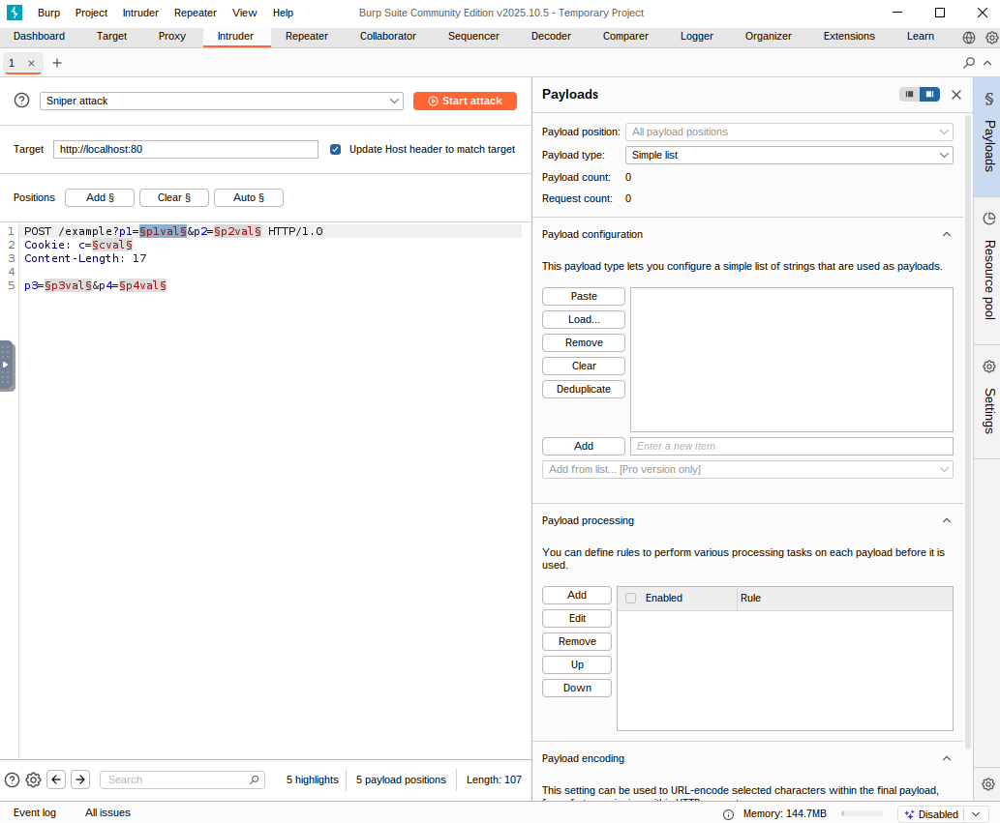
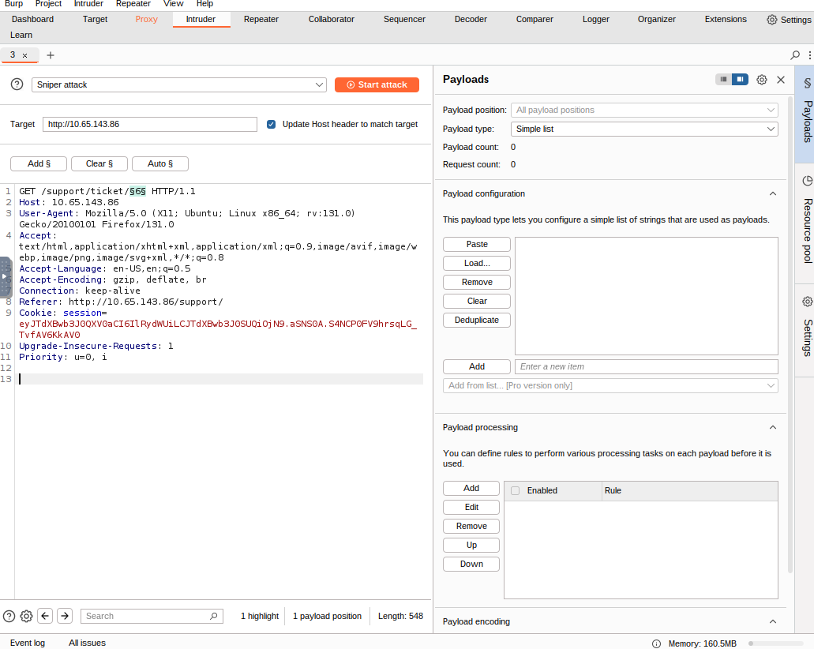
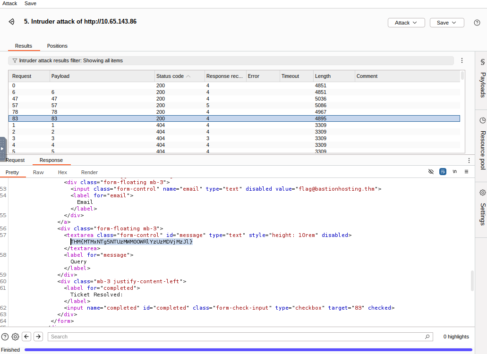

# Burp Suite: Intruder

**Platform:** [TryHackMe]

**Difficulty:** [Medium]

**Date Completed:** [2025-11-22]

---

## Description

Learn how to use Intruder to automate requests in Burp Suite.

---

## Category

Web Exploitation

---

## Solution

### Initial Analysis

This is a simple enough TryHackMe Room designed to teach us how to use Burp Suite specifically it's Intruder function which offers automated request manipulation and enables tasks such as fuzzing and brute-forcing. The Burp Basics Room is also recommended to be completed prior to attempting this room.

The room states "Burp Suite's Intruder module is a powerful tool that allows for automated and customisable attacks. It provides the ability to modify specific parts of a request and perform repetitive tests with variations of input data. Intruder is particularly useful for tasks like fuzzing and brute-forcing, where different values need to be tested against a target."

### Step-by-Step Walkthrough

#### Task 1: Introduction

We begin by starting the provided attack machine titled "Bastion v1.6-badr" and for simplicity sake I choose to use the AttackBox provided by TryHackMe's website, but you can also use your own virtual machine using their provided VPN and instructions.

Once we've started our machines up, we can go ahead and get started with the next task.


#### Task 2: What is Intruder

This task begins by describing the functionality of Intruder stating that it can send multiple requests with slightly altered values based on user-defined configurations and can be used for brute-forcing login forms using wordlists.

Intruder is rate-limited when used in conjuction with Burp Community Edition which in turn significantly reduces its speed, so often security practitioners will seek to use other fuzzing tools.

The four sub-tabs within Intruder are:

Positions: Allows us to select an attack type and configure where to insert payloads in the request template.

Payloads: Select values to insert into the positions defined in the Positions tab. Also enables us to modify Intruder's behavior regarding payloads.

Resource Pool: Allows for resource allocation amon various automated tasks.

Settings: Allows us to configure attack behavior. Deals with how Burp handles results and the attack.

 >"fuzzing" refers to the process of testing functionality or existence by apply a set of data to a parameter. For example, fuzzing for endpoints in a web application involves taking each word in a wordlist and appending it to a request URL to observe the server's response.

Now that I've read the information contained in the task, we simply answer the question.

> Question: In which Intruder tab can we define the "Attack type" for our planned attack?

> Answer: Positions

#### Task 3: Positions

Now we are given some tips about how to go about actually utilizing Intruder, but first let's actually open Burp Suite Community.

We navigate to the icon and click. Once the program is open, select 'Temporary project in memory' and click Next. On the next view, select "Use Burp defaults" and click Start Burp. Navigate to the Intruder tab and click the 'x' in the top right corner to close the pop-up and pull up the Intruder view. 

The first step is to examine the positions within the request where we want to insert our payloads. The most probable positions are highlighted in green and enclosed by (§).

The Add § button allows us to define new positions manually by highlighting them within the request editor and then clicking the button.

The Clear § button removes all defined positions, providing a blank canvas where we can define our own positions.

The Auto § button automatically attempts to identify the most likely positions based on the request. This feature is helpful if we previously cleared the default positions and want them back.

> Question: What symbol defines the start and the end of a payload position?

> Answer: §

#### Task 4: Payloads

In this task, we are introduced to the different sections under Payload.

Payload Sets: Allows us to choose the position for which we want to configure a payload set and select the type of payload we want to use.

Payload Settings: Provides options specific to the selected payload tpye for the current payload set.

Payload Processing: Can define rules to be applied to each payload in the set before it is sent to the target.

Payload Encoding: Allows us to customize the encoding options for our payloads.

Read the section and Answer the Question. For this question, I had to play around in the processing section and see which option allowed me to add characters at the end of the payload. It is also fairly obvious to figure out just by looking at the names of the rules.

> Question: Which Payload processing rule could we use to add characters at the end of each payload in the set?

> Answer: Add suffix

#### Task 5: Introduction to Attack Types

This task is also comprised of information meant to inform and assist us in executing attacks. The attacks mentioned are:

Sniper: The default and most commonly used option. It cycles through payloads, inserting one payload at a time into each position defined in the request. Allows for precise and focused testing.

Battering Ram: Sends all payloads simultaneously, each payload inserted into its respective position. Useful when testing for race conditions or when payloads need to be send concurrently.

Pitchfork: Enables the simultaneous testing of multiple positions with different payloads. Allows the tester to define multiple payload sets, each associated with a specific position in the request. Effective when there are distinct parameters that need separate testing.

Cluster bomb: Combines the Sniper and Pitchfork approaches. Performs a Sniper-like attack on each position but simultaneously tests all payloads from each set.

Use the knowledge in the task to answer the question.

> Question: What attack type cycles through the payloads inserting one payload at a time into each position defined in the request?

>Answer: Sniper

#### Task 6: Sniper

Task 6 walks us through the basics of conducting an attack utilizing Sniper.

For the sniper attack, we will need to provide a set of payloads, which can be a wordlist or a range of numbers, and it will insert each payload into each defined position.

The total number of requests made by Intruder Sniper can be calculated as "requests = numberOfWords * numberOfPositions".

> Question 1: If you were using Sniper to fuzz three parameters in a request with a wordlist containing 100 words, how many requests would Burp Suite need to send to complete the attack?

Using the above calculation we can determine requests = 100 * 3 ==> 300 requests.

> Answer: 300

> Question 2: How many sets of payloads will Sniper accept for conducting an attack?

The answer to this question is based on the previous Task where we learned that Sniper will accept 1 set of payloads per attack.

> Answer: 1

#### Task 7: Battering Ram

Task 7 walks us through conducting a Battering Ram attack which is fairly straight forward. After reading this short section, we can easily complete the question.

> Question: If you have a wordlist with two words in it (admin and Guest) and the positions in the request template look like this: username=§pentester§&password=§Expl01ted§. What would the body parameters of the first request that Burp Suite sends be?

> Answer: username=admin&password=admin

#### Task 8: Pitchfork

Task 8 walks us through conducting a Pitchfork attack. It notes that it is ideal to run with two lists of the same length as the attack stops once one of the lists reaches it's end. Once again read the information and answer the question.

> Question: What is the maximum number of payload sets we can load into Intruder in Pitchfork mode?

> Answer: 20

#### Task 9: Cluster Bomb

Task 9 walks us through conducting a Cluster Bomb attack. Once again, read the information and answer the question.

> Question: We have three payload sets. The first set contains 100 lines, the second contains 2 lines, and the third contains 30 lines. How many requests will Intruder make using these payload sets in a Cluster bomb attack?

The total number of request made is equal to the lines in each payload multiplied together, so in this case it will be 100 * 2 * 30 = 6,000.

> Answer: 6000

#### Task 10: Practical Example

Now we finally get to a task that will have us using our VMs and target machine. If you haven't already now is the time to boot them up. 

For this task, we will be attempting to gain access to the support portal located on the target machine. Looking at the source code for this support portal shows us that there isn't much present in the way of security/protective measures, which is good for us.

The task gives us some background telling us that this company "Bastion Hosting" was recently the victim of a hack exposing company employees information including passwords. Generally, we know that employees should be directed to change passwords after an event like this but that more often than not, they do not. 

So in order to find a way into the system, we should utilize the leaked plaintext passwords and attempt to force our way into the system by utilizing a credential-stuffing attack. 

Using the command provided in the prompt, we begin by downloading the leaked credentials file . We extract the files by executing the following command.

> unzip BastionHostingCreds.zip

Navigating into the extracted folder we see four wordlists, including the two we will be using 'passwords.txt' and 'usernames.txt'. 

Next we will navigate to the given url in the browser, activate the Burp Proxy and attempt to log in - capturing the request in our proxy. Once we've captured the request we navigate to the Proxy tab in Burp Suite, right-click "Send to Intruder". 

Now that we have the request in our Intruder tab, we need to set everything up for our attack. First we want to select our positions for the attack which should be the username and password fields of the request. We can manually select them or we can simply hit Auto in this instance. We want to make sure that nothing else is accidently selected. Now we switch the attack to Pitchfork Attack and in the payloads sub-tab we select the first payload set (for usernames), go to "Payload Configuration", choose "Load" and select the usernames.txt list we previously extracted. Repeat for the second payload set but this time select the passwords.txt file. 

Now we click the Start Attack button to begin the attack and scroll through the results to determine which attack was successful. Determing which credential was successful can be tricky since all the responses will return a 302 redirect status code, however, we can sort the responses by length to find the shortest which will tell us which one was successful. 

> Question: What username and password combination indicates a successful login attempt? The answer format is "username:password".

> Answer: m.rivera:letmein1

#### Task 11: Practical Challenge

Next up is our practical challenge. Since we've know gained access to an employee's website access we can experiment and see if there is anything interesting hiding in the web page. The employee's homepage shows us assigned tickets and clicking on any of the tickets shows us that they resolve to the following url: /support/ticket/NUMBER where NUMBER is the ticket number. This is important because it tells us two possible things about the construction of this website. 

1. Access Control: The endpoint may be properly configured to restrict access only to tickets assigned to our current user. In which case we won't be able to view anything we do not have access to. 

OR

2. IDOR Vulnerabiliuty: The endpoint does not have appropriate access controls resulting in an Insecure Direct Object Reference (IDOR). This would mean that we can exploit the system and read all of the tickets regardless of the assigned user. 

So to find out which it is, let's use the fuzzing technique in Intruder to find our if there is a IDOR vulnerability present.
First, while we are logged in and can see the ticket table, we enable the Burp Proxy and click on a ticket to capture the request. Then we will forward the captured request to Intruder to edit. Looking at the request the first line is a GET request that matches the url we noticed earlier. So using the Add Button we can make the number at the end of the request our position. 

For this attack, our best option would be to use a Sniper attack. 

> Question 1: Which attack type is best suited for this task?

> Answer: Sniper

Luckily, the Task also gives us a hint that the tickets are stored at values between 1 and 100 which gives us a baseline for what to run. In the payloads tab, we should select payload type "Numbers" and in the configuration section change From: to 1 and To: to 100 with 1 as the Step parameter. Once we've configured it we start the attack. 

Once the attack is complete we can sort by Status code to see all the attempts that return 200 indicating a successful redirect. In this case, we see that five tickets return a 200 Status Code. By returning to the browser and changing the last number of the url to each of these numbers we can determine which ticket contains the flag we are looking forward. For this challenge, I clicked on each successful result and navigated to the Response tab to see what was returned. 

> Question 2: What is the flag?

> Answer: THM{MTMxNTg5NTUzMWM0OWRlYzUzMDVjMzJl}

#### Task 12: Extra Mile Challenge

Now we are presented with a more challenging varient of the credential-stuffing attack we previously conducted, but this time additional measures will make brute-forcing more difficult. 

In this task, there are step-by-step instructions to provided to walk you through the challenge and explain the use of Burp Macros. Follow those to answer the question at the bottom. 

> Question: What username and password combination indicates a successful login attempt? The answer format is "username:password".

> Answer: o.bennett:bella1

---

## Flag

```
THM{MTMxNTg5NTUzMWM0OWRlYzUzMDVjMzJl}
```

---

## Tools Used

- Burp Suite Intruder - Utilized to conduct fuzzing and credential-stuffing attacks.


---

## Lessons Learned

- **Key Takeaway 1:** How to utilize the different attacks in Burp Suite Intruder including good situations to utilize them in. 


---

## References

None

---

## Notes

None
