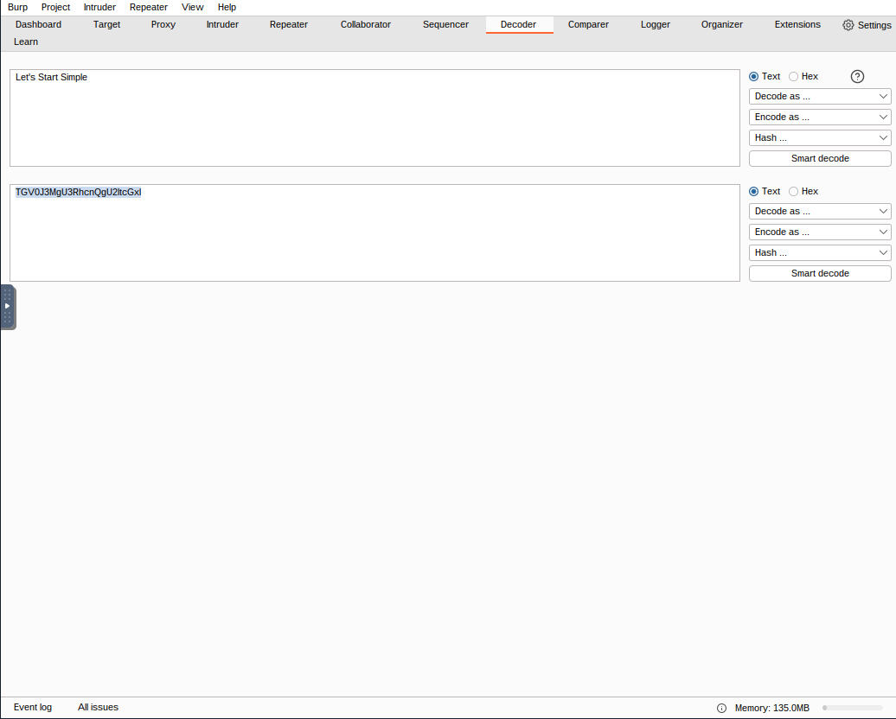
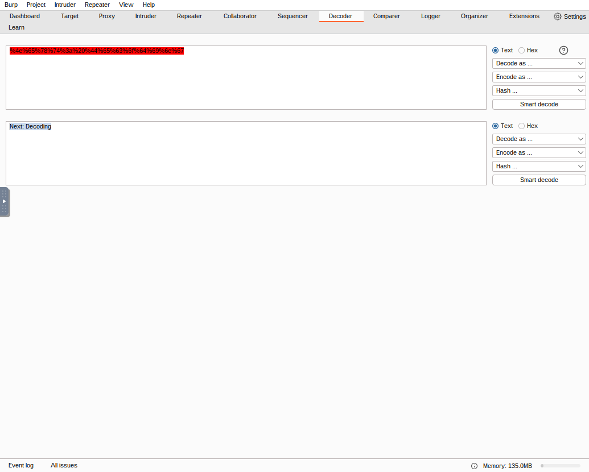
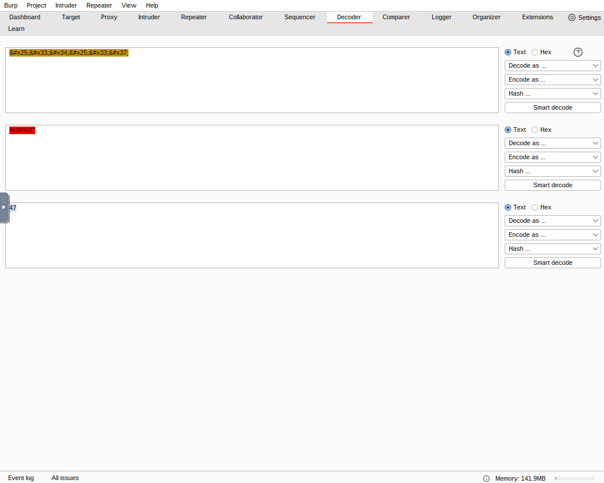
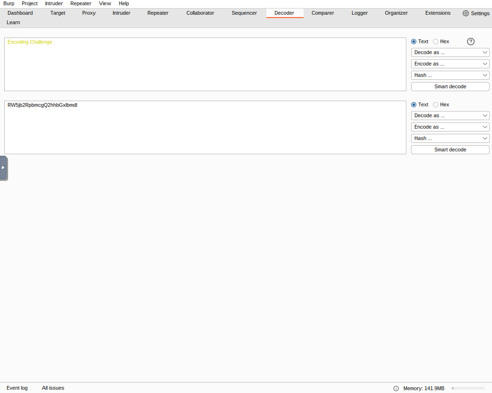
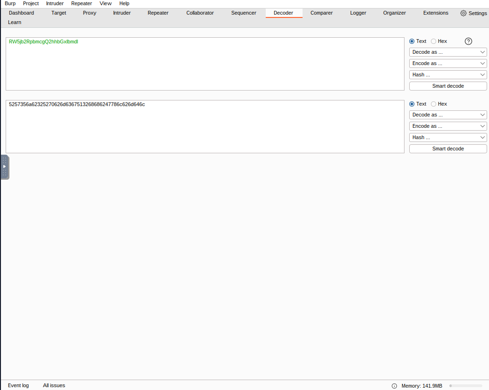
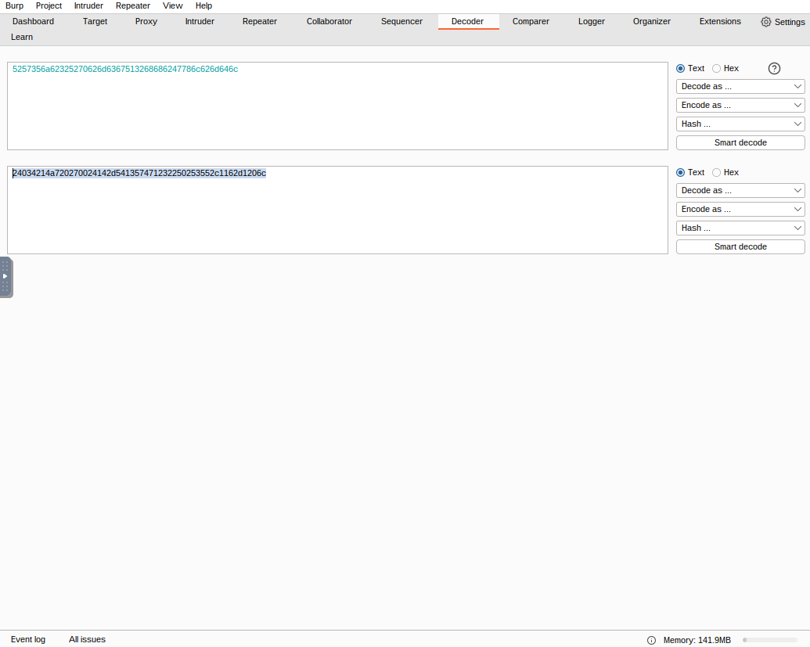
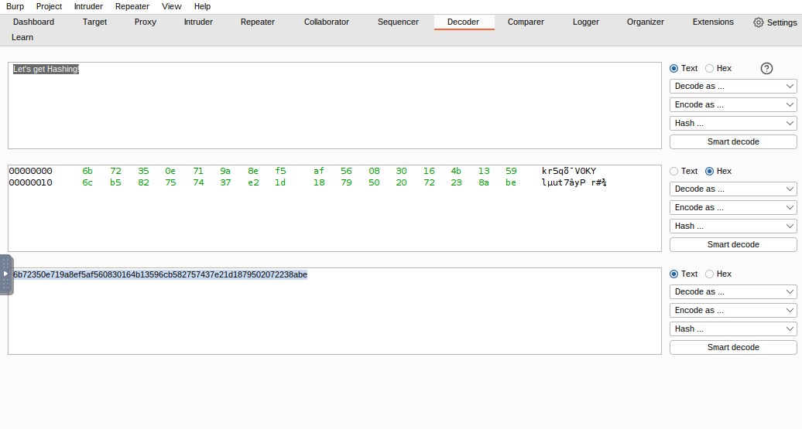
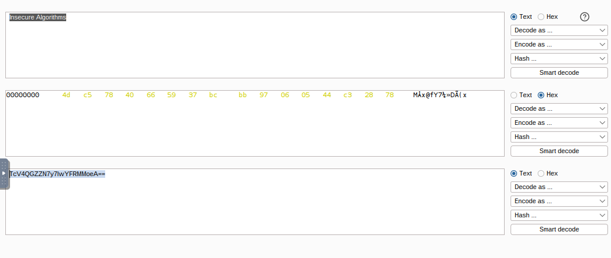
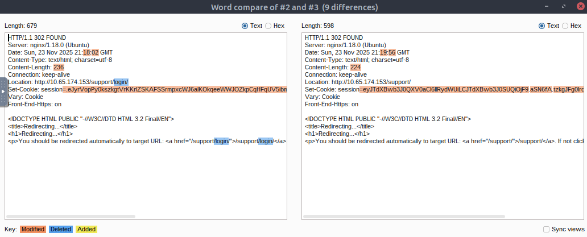
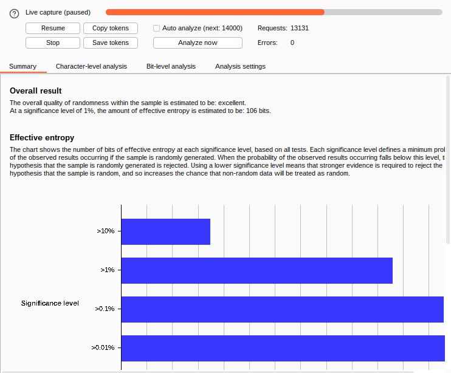

# Burp Suite: Other Modules

**Platform:** [TryHackMe]

**Difficulty:** [Easy]

**Date Completed:** [2025-11-23]

---

## Description

Take a dive into some of Burp Suite's lesser-known modules.

---

## Category

Web Fundamentals

---

## Solution

### Initial Analysis

A simple TryHackMe room designed to teach us more about using several of Burp Suite's lesser known modules such as Decoder, Comparer, Sequencer, and Organizer tools.

### Step-by-Step Walkthrough

#### Task 1: Introduction

Simply, start the target machine and the AttackBox.


#### Task 2: Decoder: Overview

The Decoder module gives user data manipulation capabilities. It also provides the function to encode our own data, to prep it for transmission to the target. In addition it allows us to create hashsums of data and has a Smart Decode feature which can decode provided data recursively until it's back in plaintext. This task describes to us the basic functionality of the module. Read it and experiment then proceed to answer the questions.

> Question: Which feature attempts auto-decode of the input?

> Answer: Smart Decode


#### Task 3: Decoder: Encoding/Decoding

This task describes to us the details of utilizing the encoding and decoding functions. Almost all of these encoding/decoding options are familiar to me, except for Gzip which is easily explained as it compresses data, reducing file and page sizes before browser transmission. So very similar to any other sort of zipping function. Following the guidance given in this task, we proceed to answer the questions.

> Question 1: Base64 encode the phrase: Let's Start Simple. What is the base64 encoded version of this text?

> Answer: TGV0J3MgU3RhcnQgU2ltcGxl



> Question 2: URL Decode this data: %4e%65%78%74%3a%20%44%65%63%6f%64%69%6e%67. What is the plaintext returned?

> Answer: Next: Decoding



> Question 3: Use Smart decode to decode this data: '&#x25;&#x33;&#x34;&#x25;&#x33;&#x37;'. What is the decoded text?

> Answer: 47



> Question 4: Encode this phrase: Encoding Challenge. Start with base64 encoding. Take the output of this and convert it into ASCII Hex. Finally encode this hex string into octal. What is the final string?

> Answer: 24034214a720270024142d541357471232250253552c1162d1206c






#### Task 4: Decoder: Hashing

Important Note: This task requires us to download some files, however, if you download these files outside of the VM environment you probably notice via some warning provided by your browser or anti-virus software that these files contain malware. As such you should either use the files located inside the provided AttackBox or download the files in a VM separated from the Network for safety reasons. 

In this task we learn about using the decoder function to perform hashing. Hashing is an important technique in security that helps provide users with verification of the integrity of files. It can also help security analyst to determine if files may match known malware or virus files. Read this section and answer the questions.

> Question 1: Using Decoder, what is the SHA-256 hashsum of the phrase: Let's get Hashing! ? Convert this into an ASCII Hex string for the answer to this question.

> Answer: 6b72350e719a8ef5af560830164b13596cb582757437e21d1879502072238abe



> Question 2: Generate an MD4 hashsum of the phrase: Insecure Algorithms. Encode this as base64 (not ASCII Hex) before submitting.

> Answer: TcV4QGZZN7y7lwYFRMMoeA==



For this next question, we utilized the files in the deployed VM. You can access them using the following:

```bash
wget http://IP_ADDRESS_HERE:9999/AlteredKeys.zip
```

> Question 3: "Some joker has messed with my SSH key! There are four keys in the directory, and I have no idea which is the real one. The MD5 hashsum for my key is 3166226048d6ad776370dc105d40d9f8 could you find it for me?"

For this question, we unzip the above file, navigate to the directory containing the keys, and copy the contents of each into Burp Suite using:

```bash
unzip AlteredKeys.zip
cd keys
cat key1
cat key2
cat key3
cat key4
```
File key1 gives us: 

b523e7a5b4e82a254f2669e46a7c012a

File key2 gives us: 

915fb4c73cc1acc350fae502f6655500

File key3 gives us:

3166226048d6ad776370dc105d40d9f8

File key4 gives us:

c0a448edc9f1bc4b10c0ffc6eb79a005

As you can see key3 matches our desired MD5 hashsum. If you get stuck, remember to copy paste the entire contents of the file into Burp Suite.

> Answer: key3

#### Task 5: Comparer: Overview

This task introduces us to Comparer which lets us compare two pieces of data either by ASCII words or by bytes. Once we read the description we can go ahead and proceed to the next task.

#### Task 6: Comparer: Example

For this task, we will follow the steps provided to display a practical example of the uses of this module. First, we will navigate to the directed URL and enable the Burp Proxy to capture the request. 

We then attempt to login with incorrect credentials and send the resulting request to the Repeater function. We will send the request from the repeater function and then right-click on the response and send it to the comparer.

We then return to the repeater tab and modify the request by changing username: support_admin and password: w58ySK4W and send again. Once again send the response to the comparer. 

When we go to the comparer, select our responses and view the differences we can see that they have different content-lengths, and they go to different locations. 


That completes this challenge.

#### Task 7: Sequencer: Overview

Sequencer allows us to evaluate the entropy or randomness of tokens. Tokens should ideally be generated in a cryptographically secure manner. 

With Sequencer there are two ways to perform token analysis:

- Live Capture: The more common method. Lets us pass a request that will generate a token to Sequencer for analysis then automatically make the same request thousands of times, storing the generated token samples for analysis.

- Manual Load: Allows us to load a list of pre-generated token samples directly into Sequencer for analysis. Requires we have a large list of pre-generated tokens. 

Now we can answer the question.

> Question: What does Sequencer allow us to evaluate?

> Answer: Entropy

#### Task 8: Sequencer: Live Capture

From here we will begin to see the actual process of using Live Capture. First, we will capture a request to the provided URL and send it to the Sequencer. 

Next we select "Form Field" and modify it to the loginToken and start live capture. Once we've collected ~10,000 tokens we will pause the capture and click Analyze now to generate a report. 

> Question: What is the overall quality of randomness estimated to be?

> Answer: excellent



#### Task 9: Sequencer: Analysis

Looking at the analysis of the capture we conducted, we can see that it is split up into different sections. Those sections are:

- Overall Result: Gives a broad assessment of the security of the token generation mechanism.

- Effective Entropy: Measures the randomness of the tokens. 117 bits is relatively high, indicating the tokens are sufficiently random and therefore likely secure.

- Reliability: The significance level of 1% implies there is 99% confidence in the accuracy of the results. This is quite high.

- Sample: Provides details about the token samples analyzed during the entropy testing process.

#### Task 10: Organizer: Overview

Organizer is designed to help us store and annotate copies of HTTP requests that we may want to revisit later. Useful for organizing our penetration testing workflow.

> Question: Are saved requests read-only? (yea/nay)

> Answer: yea


## Tools Used

- Burp Suite Decoder  - Used to decode and encode various items.
- Burp Suite Comparer - Used to compare the contents of two texts or hashes
- Burp Suite Sequencer - Used to determine the entropy of token generation
- Burp Suite Organizer - Used to store http requests for later analysis [read-only]
---

## Lessons Learned

- **Key Takeaway 1:** Burp Suite has a myriad of useful modules to learn and be used. The most successful attackers will be able to manipulate all of them and intertwine them in useful ways.

---

## References

- None

---

## Screenshots

All screenshots for this write-up are stored in the `./images/` directory.

---

## Notes

None.
