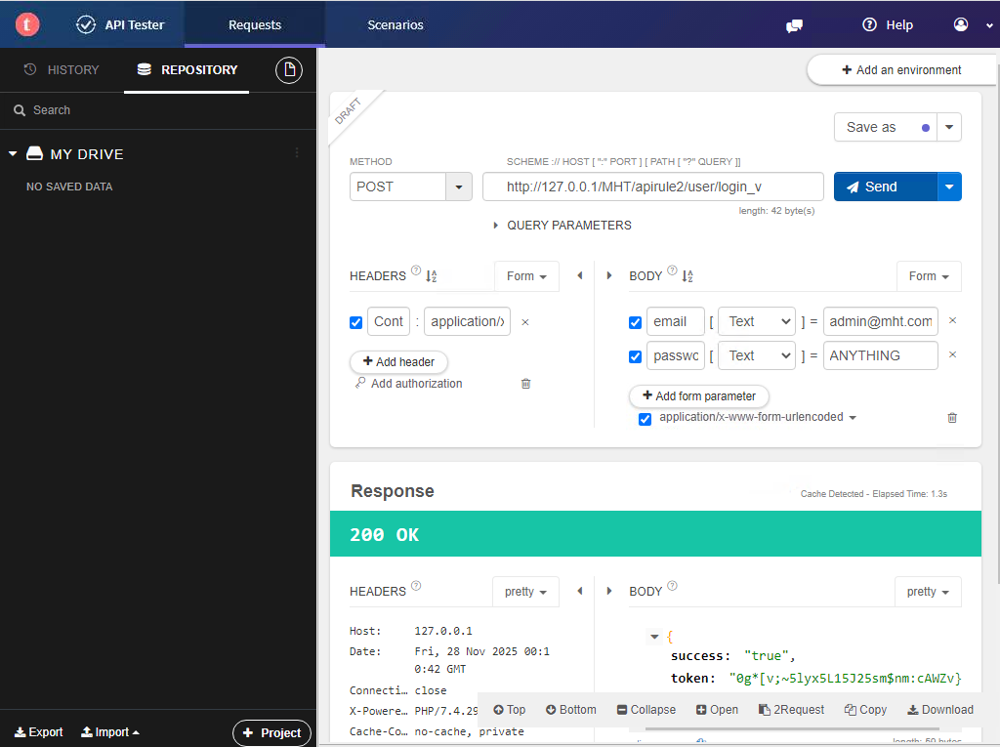

# OWASP API Security Top 10-1

**Platform:** [TryHackMe]

**Difficulty:** [Medium]

**Date Completed:** [2025-11-DD]

---

## Description

Learn the basic concepts for secure API development (Part 1).

---

## Category

Web Exploitation

---

## Solution

### Initial Analysis

Open Worldwide Application Security Project (OWASP) is a non-profit and collaborative online community that aims to improve application security via a set of security principles, articles, documentation etc. Back in 2019, OWASP released a list of the top 10 API vulnerabilities, which will be discussed in detail, along with its potential impact and a few effective mitigation measures.

### Step-by-Step Walkthrough

#### Task 1: Introduction

For this room, we will need the following pre-requisities:
- How websites work
- HTTP protocols and methods
- Principles of security
- OWASP top 10 web vulnerabilities

The learning objectives for this room are:
- Best practices for API authorisation and authentication
- Identification of authorisation level issues
- Handling excessive data exposure
- Lack of resources and rate-limiting issues

This initial task details how to access the desired machine and the credentials required. Once we have the machine loaded and verified we can get access, we proceed to the next task.

#### Task 2: Understanding APIs - A Refresher

We start out with a refresher about what APIs are. This is all very basic information so we can simply skim through this section and move on to answering the questions below.

> Question 1: In the LinkedIn breach (Jun 2021), how many million records (sample) were posted by a hacker on the dark web?

> Answer: 1

> Question 2: Is the API documentation a trivial item and not used after API development (yea/nay)?

> Answer: nay

#### Task 3: Vulnerability I - Broken Object Level Authorisation (BOLA)

The first vulnerability we are going to learn about is referred to as BOLA. It refers to Insecure Direct Object Reference (IDOR) which creates a scenarion where the user uses the input functionality and gets access to the resources they are not authorized to access. In APIs such controls are usually implemented through programming in Models (Model-View-Controller Architecture) at the code level.

Unauthorized object access can lead to data leakage and in some cases complete account takeover. 

Now that we know more about the vulnerability, we open the VM to perform a practical example. We see that using Talend API Tester and sending a GET request to the provided vulnerable URL, we received a flag that reads THM{00123123}. Interestingly enough, this task does not ask us for this flag. We see that if we change the url to _s instead of _v and provide a valid Authorization-Token, only then can we see the correct results. Otherwise, we get an invalid token that shows 403 Forbidden as an error message.

The following mitigation measures are recommended:
- An authorization mechanism that relies on user policies and hierarchies should be adequately implemented.
- Strict access controls methods to check if the logged-in user is authorized to perform specific actions.
- Promote using completely random values (strong encryption and decryption mechanism) for nearly impossible-to-predict tokens.

Now we answer the questions.

> Question 1: Suppose the employee ID is an integer with incrementing value. Can you check through the vulnerable API endpoint the total number of employees in the company?

Now for this, I changed the end of the URL to 100 and saw that there was no content in the response. I then cut it in half and did 50. Still no content. Then I realized maybe this is a small group of employees so I tried 10. Still no content! At this point it was more advantages to start at 2 and work my way up. At 4 I no longer received any content so I know that there must only be 3 employees.

> Answer: 3

> Question 2: What is the flag associated with employee ID 2?

Simply change the number at the end of the URL to 2 and retrieve the flag associated.

> Answer: THM{838123}

> Question 3: What is the username of employee ID 3?

> Answer: Bob

#### Task 4: Vulnerability II - Broken User Authentication (BUA)

Broken user authentication reflects a scenario where an API endpoint allows attacker to access a database or acquire a higher privilege than the existing one. The reason behind this is either invalid implementation of authentication or the absence of security mechanisms. Following the instructions provided we can see a practical example of this vulnerability in real-time.  

In this example we can see that there is an endpoint which passes an authorization token in a GET request but it is not properly authenticated. In this scenario, only the email is used to validate the user, not the password, which would mean an attacker only needs the victim's email address to conduct an account takeover. We test this in the VM by first sending a POST request to http://localhost:80/MHT/apirule2/user/login_v with email and password in the form parameters. Email: admin@mht.com and the password can be literally anything. 

To mitigate this vulnerability:
- Ensure complex passwords with higher entropy for end users.
- Do not expose sensitive credentials in GET or POST requests.
- Enable strong JSON Web Tokens (JWT), authorization headers etc.
- Ensure the implementation of multifactor authentication (where possible), account lockout, or a captcha system to mitigate brute force against particular users.
- Ensure that passwords are not saved in plain text in the database to avoid further account takeover by the attacker.

> Question 1: Can you find the token of hr@mht.com?

We will use the same skills we utilized in the practical example to find this token as well.

> Answer: cOC%Aonyis%H)mZ&uJkuI?_W#4&m>Y

> Question 2: To which country does sales@mht.com belong?

For this we repeat the same steps as the example and the first question to get the token of sales@mht.com. We then take the authorization-token that is output in the response and create a new GET request with the token in the headers section under "Authorization-Token". This should give us the details of the user.

> Answer: China

> Question 3: Is it a good practice to send a username and password in a GET request (yea/nay)?

If you send sensitive information in a GET or POST request, you risk exposing those credentials to malicious entities. Best to avoid that route.

> Answer: nay

#### Task 5: Vulnerability III - Excessive Data Exposure

Excessive data exposure occurs when applications tend to disclose more than desired information to the user through an API response. Application developers tend to expose all object properties without considering their sensitivity level. An attacker can intercept the response through the API and quickly extract the desired confidential data.

Next, we conduct the practical example. We can use the steps provided to complete the questions at the end of the task.

Mitigation Measures:
- Never leave sensitive dat filtration tasks to the front-end developer
- Ensure time-to-time review of the respones from the API to guarantee it returns only legitimate data and checks if it poses any security issue,
- Avoid using generic methods such as to_string() and to_json()
- Use API endpoint testing through various test cases and verify through automated and manual tests if the API leaks additional data.

> Question 1: What is the device ID value for post-ID 2?

> Answer: iOS15.411

> Question 2: What is the username value for post-ID 3?

> Answer: hacker#!

> Question 3: Should we use network-level devices for controlling excessive data exposure instead of managing it through APIs (programmatically) - yea/nay?

> Answer: nay

#### Task 6: Vulnerability IV - Lack of Resources and Rate-Limiting

Lack of resources and rate limiting means that APIs do not enforce any restriction on the frequency of clients' requested resources or the files' size, which badly affects the API server performance and leads to the DoS (Denial of Service) or non-availability of service. 

Next, we conduct the practical example. We can use the steps provided to complete the questions at the end of the task.

Mitigation Measures:
- Ensure using a captcha to avoid requests from automated scripts and bots.
- Ensure implementation of a limit i.e. how often a client can call an API wihtin a specified time and notify instantly when the limit is exceeded.
- Ensure to define the maximum data size on all parameters and payloads i.e. max string length and max number of array elements.

> Question 1: Can rate limiting be carried out at the network level through firewall etc. (yea/nay)

> Answer: yea

> Question 2: What is the HTTP response code when you send a POST request to /apirule4/sendOTP_s using the email address hr@mht.com?

> Answer: 200

> Question 3: What is the "msg key" value after an HTTP POST request to /apirule4/sendOTP_s using the email address sale@mht.com?

> Answer: invalid email

#### Task 7: Vulnerability V - Broken Function Level Authorization

A scenario where a low privileged user bypasses system checks and gets access to confidential data by impersonating a high privileged user (Admin). This can lead an intruder to impersonate an authorized user and let teh malicious actor get administrative rights to perform sensitive tasks.

Now, we perform the practical example. 

Mitigation Measures:
- Ensure proper design and testing of all authorization systems and deny all access by default. 
- Ensure that the operations are only allowed to the users belonging to the authorized group
- Make sure to review API endpoints against flaws regarding functional level authorization and keep in mind the apps and group hierarchy's business logic.

> Question 1: What is the mobile number for the username Alice?

> Answer: +1235322323

> Question 2: Is it a good practice to send isAdmin value through the hidden fields in form requests - yea/nay?

> Answer: nay

> Question 3: What is the address flag of username admin?

> Answer: THM{3432$@#2!}

## Notes

No additional notes.
